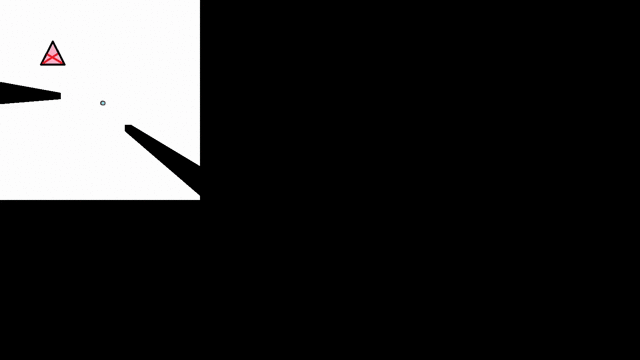

# FogOfWar
Proof of concept for fog of war lighting and rendering

Goal is to:
1. get a small entity moving in response to user input
2. draw area that the entity can see
3. do not draw areas that the entity cannot see
4. support multiple light sources
5. stylize border of visible versus not visible area

###Demo

###Misc
You will need Monogame to build this.
